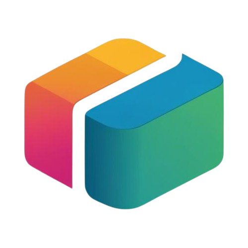

<h1 align="center">
  <br/>
  React Native Trendy Library
</h1>

A powerful, customizable, and type-safe styling library for React Native applications that supports light and dark themes with ease.

---

## 🌟 Features

- **Dynamic Themes**: Supports light and dark mode with seamless transitions.
- **Type-safe**: Customizable color palettes and styles with full TypeScript support.
- **Predefined Styles**: Includes a wide range of reusable styles for borders, padding, margins, etc.
- **Customizable Components**: Prebuilt themed components like `ThemedText` and `ThemedView`.

---

## 🚀 Getting Started

### Installation

```bash
npm install react-native-trendy
```

or

```bash
yarn add react-native-trendy
```

---

## 📖 Usage

### Setting Up the Theme

Wrap your app with the `ThemeProvider` from `ThemeContext`:

```tsx
import React from 'react';
import { ThemeProvider } from 'react-native-trendy';
import { NewApp } from './App';

const App = () => (
  <ThemeProvider>
    <NewApp />
  </ThemeProvider>
);

export default App;
```

### Accessing Colors

Use the `useColors` hook to get the theme-specific colors:

```tsx
import React from 'react';
import { View, Text } from 'react-native';
import { useColors } from 'react-native-trendy';

const MyComponent = () => {
  const colors = useColors();

  return (
    <View style={{ backgroundColor: colors.primary }}>
      <Text style={{ color: colors.text }}>Hello trendy World!</Text>
    </View>
  );
};

export default MyComponent;
```

### Using Custom Colors

```tsx
import { setCustomColors } from 'react-native-trendy';
import { TouchableOpacity } from 'react-native';


type MyCustomPalette = {
  customPrimary: string;
  customSecondary: string;
};

setCustomColors<MyCustomPalette>({
  light: {
    customPrimary: '#ff5733',
    customSecondary: '#57ff33',
  },
  dark: {
    customPrimary: '#5733ff',
    customSecondary: '#33c1ff',
  },
});

const CustomComponent = () => {
  const colors = useColors<MyCustomPalette>();

  return (
    <TouchableOpacity
      style={[
        {
          backgroundColor: colors.customSecondary,
        },
        paddingStyle.padding12,
        borderRadiusStyle.borderRadius12,
      ]}
      onPress={() => {}}
    >
      <ThemedText>React Native trendy</ThemedText>
    </TouchableOpacity>
  );
};
```

## 📦 Components

### `ThemedView`
A `View` component that adapts to the current theme.

```tsx
import { ThemedView } from 'react-native-trendy';

<ThemedView>
  <Text>Hello, Themed World!</Text>
</ThemedView>;
```

### `ThemedText`
A `Text` component that applies theme-specific styles.

```tsx
import { ThemedText } from 'react-native-trendy';

<ThemedText>Styled Text</ThemedText>;
```

## Hooks

### `useColors`

The `useColors` hook provides access to the current theme’s colors (light or dark). It returns the extended color palette, including both default and custom colors.

#### Usage:

```tsx
import { useColors } from 'your-library-name';

const MyComponent = () => {
  const colors = useColors();

  return (
    <View style={{ backgroundColor: colors.primary }}>
      <Text style={{ color: colors.text }}>Hello, World!</Text>
    </View>
  );
};
```

### `useTheme`
The `useTheme` hook provides access to the current theme context. It is used internally by useColors but can also be used directly if needed.

#### Usage:

```tsx
import { useTheme } from 'your-library-name';

const MyComponent = () => {
  const { theme } = useTheme();

  return (
    <View>
      <Text>The current theme is: {theme}</Text>
    </View>
  );
};
```

### `useStyles`

The `useStyles` hook provides predefined style functions that are dynamically adjusted based on the current theme and color palette.

#### Usage:

```tsx
import useStyles from 'your-library-name';

const MyComponent = () => {
  const styles = useStyles();

  return (
    <View style={styles.containerBackgroundColorStyle}>
      <Text style={styles.textColorStyle}>Styled Text</Text>
    </View>
  );
};
```

## Predefined Styles

| **Style**                | **Value**  | **Example Usage**          |
|--------------------------|------------|----------------------------|
| **alignItems**              | Center, Start, End, Stretch  | `alignItemsStyle.alignItemsCenter` |
| **borderBottomLeftRadius**  | 0-32                         | `borderBottomLeftRadiusStyle.borderBottomLeftRadius1` |
| **borderBottomRightRadius** | 0-32                         | `borderBottomRightRadiusStyle.borderBottomRightRadius1` |
| **borderBottomWidth**       | 0-32                         | `borderBottomWidthStyle.borderBottomWidth1` |
| **borderLeftWidth**         | 0-32                         | `borderLeftWidthStyle.borderLeftWidth1` |
| **borderRadius**            | 0-32                         | `borderRadiusStyle.borderRadius1` |
| **borderRightWidth**        | 0-32                         | `borderRightWidthStyle.borderRightWidth1` |
| **borderTopLeftRadius**     | 0-32                         | `borderTopLeftRadiusStyle.borderTopLeftRadius1` |
| **borderTopRightRadius**    | 0-32                         | `borderTopRightRadiusStyle.borderTopRightRadius1` |
| **borderTopWidth**          | 0-32                         | `borderTopWidthStyle.borderTopWidth1` |
| **flex**                    | 1-32                         | `flexStyle.flex1` |
| **flexDirection**           | Row, Column, RowReverse, ColumnReverse | `flexDirectionStyle.flexDirectionRow` |
| **gap**                     | 0-32                         | `gapStyle.gap1` |
| **height**                  | 0, 4, 8, ..., 100           | `heightStyle.height40` |
| **justifyContent**          | Center, Start, End, SpaceBetween, SpaceAround | `justifyContentStyle.justifyContentCenter` |
| **margin**                  | -32, -31, -30, ..., 32       | `marginStyle.margin32` |
| **marginBottom**            | -32, -31, -30, ..., 32       | `marginStyle.marginBottom32` |
| **marginHorizontal**        | -32, -31, -30, ..., 32       | `marginStyle.marginHorizontal32` |
| **marginLeft**              | -32, -31, -30, ..., 32       | `marginStyle.marginLeft32` |
| **marginRight**             | -32, -31, -30, ..., 32       | `marginStyle.marginRight32` |
| **marginTop**               | -32, -31, -30, ..., 32       | `marginStyle.marginTop32` |
| **marginVertical**          | -32, -31, -30, ..., 32       | `marginStyle.marginVertical32` |
| **padding**                 | -32, -31, -30, ..., 32       | `paddingStyle.padding32` |
| **paddingBottom**           | -32, -31, -30, ..., 32       | `paddingStyle.paddingBottom32` |
| **paddingHorizontal**       | -32, -31, -30, ..., 32       | `paddingStyle.paddingHorizontal32` |
| **paddingLeft**             | -32, -31, -30, ..., 32       | `paddingStyle.paddingLeft32` |
| **paddingRight**            | -32, -31, -30, ..., 32       | `paddingStyle.paddingRight32` |
| **paddingTop**              | -32, -31, -30, ..., 32       | `paddingStyle.paddingTop32` |
| **paddingVertical**         | -32, -31, -30, ..., 32       | `paddingStyle.paddingVertical32` |
| **position**                | relative, absolute, fixed    | `positionStyle.positionRelative` |
| **ratioheight**             | 0%, 4%, 8%, ..., 100%        | `ratioheightStyle.height40` |
| **ratioWidth**              | 0%, 4%, 8%, ..., 100%        | `ratioWidthStyle.width40` |
| **shadow**                  | Color: #000, Offset: (0, 2), Opacity: 0.25, Radius: 3.84, Elevation: 5 | `shadowStyle.shadow` |
| **textAlign**               | center, left, right, justify | `textAlignStyle.textAlignCenter` |
| **textFontSize**            | 6, 8, 10, ..., 32            | `textFontSizeStyle.textFontSize6` |
| **textFontWeight**          | bold, 100, ..., 900, normal, light | `textFontWeightStyle.textFontWeightBold` |
| **width**                   | 0, 4, 8, ..., 100           | `widthStyle.width40` |

## Predefined Colors

Here is the list of predefined colors available in the library:

### Light Theme Colors

| Name                  | Hex Value   | Preview                               |
|-----------------------|-------------|---------------------------------------|
| `light`               | `#fff`      |  |
| `dark`                | `#000`      |  |
| `screenBackground`    | `#EDF0F8`   |  |
| `text`                | `#11181C`   |  |
| `primary`             | `#1B84FF`   |  |
| `lightPrimary`        | `#E9F3FF`   |  |
| `danger`              | `#F8285A`   |  |
| `lightDanger`         | `#FFEEF3`   |  |
| `success`             | `#17C653`   |  |
| `lightSuccess`        | `#EAFFF1`   |  |
| `secondary`           | `#F1F1F4`   |  |
| `lightSecondary`      | `#F9F9F9`   |  |
| `info`                | `#7239EA`   |  |
| `lightInfo`           | `#F8F5FF`   |  |
| `warning`             | `#F6C000`   |  |
| `lightWarning`        | `#FFF8DD`   |  |
| `brand`               | `#FF6F1E`   |  |
| `lightBrand`          | `#FFF5EF`   |  |
| `gray100`             | `#F9F9F9`   |  |
| `gray200`             | `#F1F1F4`   |  |
| `gray300`             | `#DBDFE9`   |  |
| `gray400`             | `#C4CADA`   |  |
| `gray500`             | `#99A1B7`   |  |
| `gray600`             | `#78829D`   |  |
| `gray700`             | `#4B5675`   |  |
| `gray800`             | `#252F4A`   |  |
| `gray900`             | `#071437`   |  |

### Dark Theme Colors

| Name                  | Hex Value   | Preview                               |
|-----------------------|-------------|---------------------------------------|
| `light`               | `#1a1b24`   |  |
| `dark`                | `#fff`      |  |
| `screenBackground`    | `#1a1b24`   |  |
| `text`                | `#ECEDEE`   |  |
| `primary`             | `#006AE6`   |  |
| `lightPrimary`        | `#172331`   |  |
| `danger`              | `#E42855`   |  |
| `lightDanger`         | `#302024`   |  |
| `success`             | `#00A261`   |  |
| `lightSuccess`        | `#1F2623`   |  |
| `secondary`           | `#363843`   |  |
| `lightSecondary`      | `#363843`   |  |
| `info`                | `#883FFF`   |  |
| `lightInfo`           | `#272134`   |  |
| `warning`             | `#C59A00`   |  |
| `lightWarning`        | `#242320`   |  |
| `brand`               | `#D74E00`   |  |
| `lightBrand`          | `#272320`   |  |
| `gray100`             | `#1B1C22`   |  |
| `gray200`             | `#26272F`   |  |
| `gray300`             | `#363843`   |  |
| `gray400`             | `#464852`   |  |
| `gray500`             | `#636674`   |  |
| `gray600`             | `#808290`   |  |
| `gray700`             | `#9A9CAE`   |  |
| `gray800`             | `#B5B7C8`   |  |
| `gray900`             | `#F5F5F5`   |  |

---

## 🛠️ Contributing

1. Fork the repository.
2. Create a feature branch (`git checkout -b feature-name`).
3. Commit your changes (`git commit -m 'Add a new feature'`).
4. Push to the branch (`git push origin feature-name`).
5. Open a pull request.

---

## ⚖️ License

This project is licensed under the MIT License. See the `LICENSE` file for details.